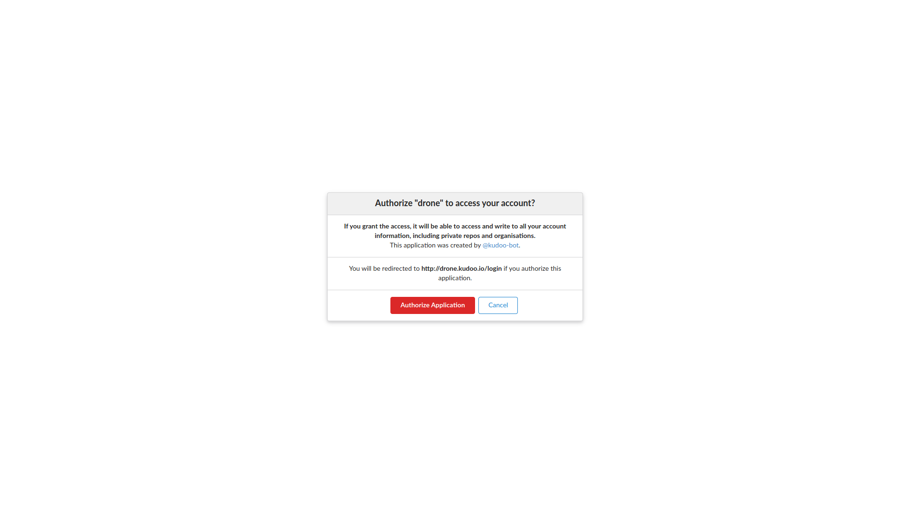
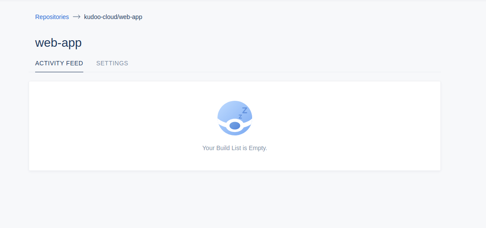

# Deployments
There are two ways that Kudoo supports you releasing new versions of your app. Automated and manual.

## Automated deployments
To get started using automated deployments there is some setup you'll need to perform.

We use [Drone](https://drone.io/) for our Automated deployments. 

Once you signed up for Kudoo cloud through the [Portal](https://portal.kudoo.io) all you need to do to activate your Drone account is to visit https://drone.kudoo.io and then authorise the application. 

You will now have access to Drone.

You can now open the `web-app` repository

Under the source directory there will be a file called `.drone.yml`. 

### Configuring your Pipelines
In order for your deployments to work you'll need to enter the `secrets` of your application.

NODE_ENV=development
GRAPHQL_API_URL=http://localhost:4000/api/
SKELM_BASE_URL=http://localhost:4000

## Manual deployments

To do this you'll need to clone you app your app locally.

You'll need to make sure you have [Node installed](https://nodejs.org/en/download/)

Then make sure you are using the correct version. As of this writing, the latest LTS version of Node is version 12. 

**Please note** Kudoo will always use the currently active LTS node release.

Now make sure you have [Firebase Tools](https://github.com/firebase/firebase-tools) installed by running:
`npm install -g firebase-tools`

You can now run
`firebase deploy` 
to deploy your app.